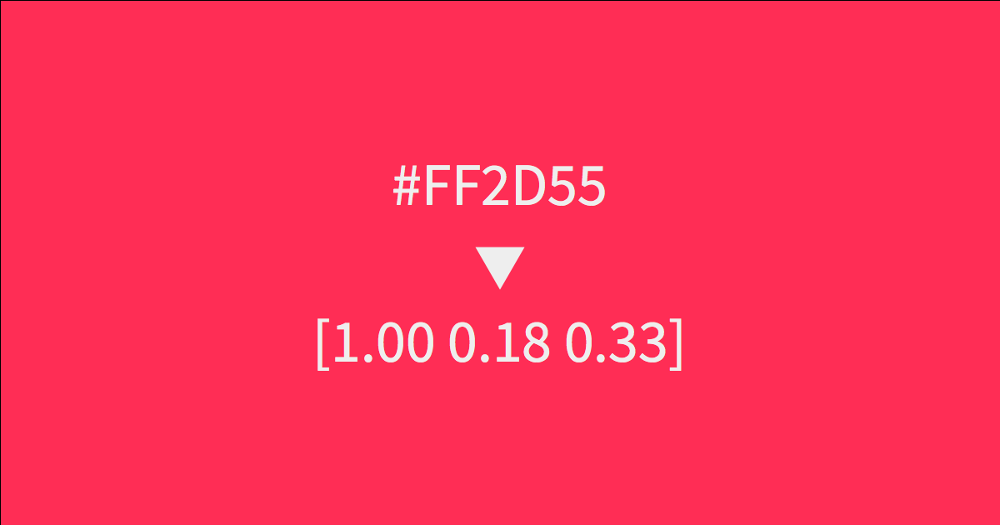
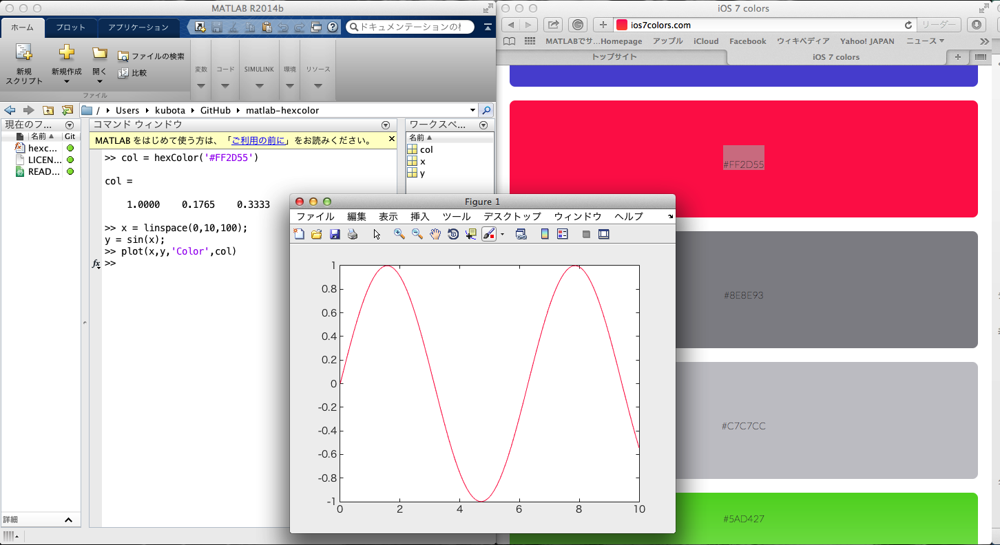

# matlab-hexcolor


Matlab function to convert a hex color code to a RGB color vector.


### Usage
1. Put **hexcolor.m** on your directory.
2. Write on console ```v = hexcolor('#ec3a34')``` and run.
3. *v* is a three dimentonal vector: [0.9255    0.2275    0.2039].
4. You can use this color for ploted line color, text, etc.

### Function
```
col = hexcolor(str)
% str: hex color code as string data (e.g. '#FF0000')
% col: RGB vector.
```
